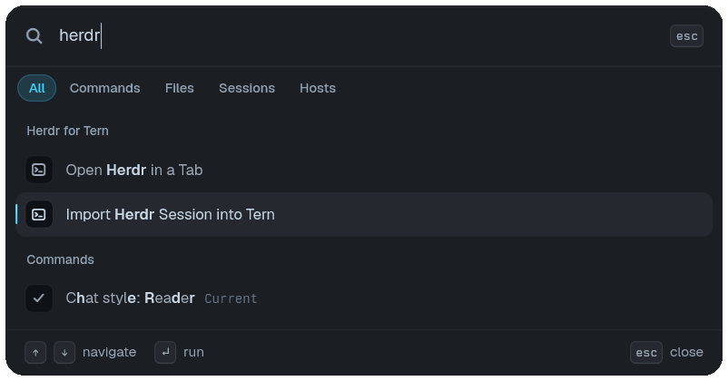

# Herdr for Tern

Switching from Herdr to Tern? Bring your sessions with you.



**Import Herdr Session into Tern** copies a running session into Tern. The picker lists every local session with its workspace and tab counts, and the workspaces inside each one, so you can see what you are bringing over before anything runs. Pick which workspaces come along, choose where they land (a new session, whose row shows the exact name it will take, or a session that already exists), and whether they arrive as one session or one per workspace. Herdr keeps running: it is a copy, not a move.

If you would rather keep using a session from inside Tern for a while, **Open Herdr in a Tab** runs its Herdr client in a Tern tab instead.

Both commands are in Tern's palette, found by searching `herdr`; they also have chords, `ctrl+alt+shift+h` to open the picker and `ctrl+alt+shift+i` to go straight to the import (`cmd+alt+shift` on macOS).

## Get started

```sh
tern plugin install github.com/gabrielmoreira/herdr-tern-plugin
```

You need desktop Tern and Herdr. The plugin looks for `herdr` on Tern's PATH and in Herdr's own install folders; set `HERDR_BIN` if it lives somewhere else.

## Notes

- Every mirrored pane starts in the same directory, running the same program as its Herdr pane. Exact split ratios are not reproduced.
- On Windows, a console window flashes on each refresh, because Tern spawns plugin children without `CREATE_NO_WINDOW`. Details in [TERN-PLUGIN-FEEDBACK.md](TERN-PLUGIN-FEEDBACK.md).

Made by [Gabriel Moreira](https://github.com/gabrielmoreira). [MIT](LICENSE).
